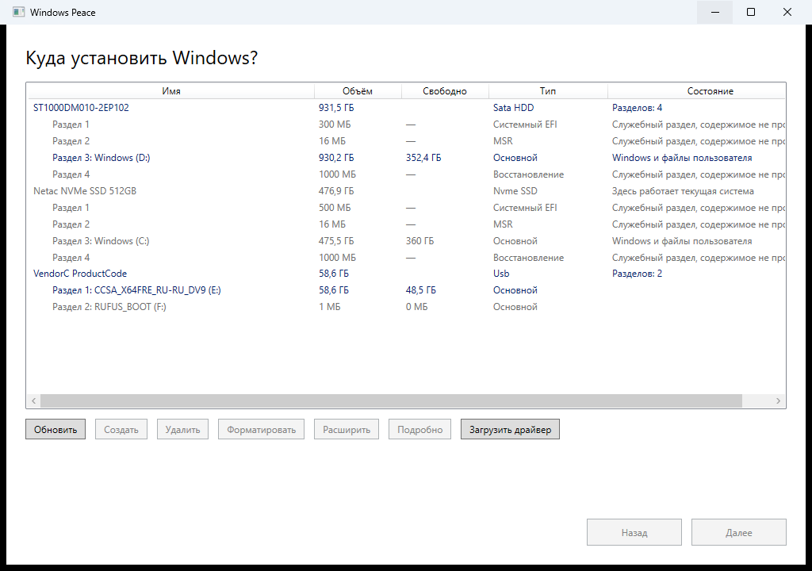

# Приёмка шага А

Дата: 11.08.2026 · Задача 11 [плана шага А](../plans/2026-08-10-step-a-disk-picker.md)
· Проверка на машине автора, обычная Windows 11 Pro, **без прав администратора**



## Десять пунктов из плана

| № | Что проверялось | Итог |
|---|---|---|
| 1 | Окно открылось, заголовок «Куда установить Windows?» | да |
| 2 | Видны все диски машины | да, три: 931,5 ГБ SATA HDD, 476,9 ГБ NVMe SSD, 58,6 ГБ USB |
| 3 | Разделы показаны под своими дисками с отступом | да, десять разделов на трёх дисках |
| 4 | Диск с работающей системой выбрать нельзя, написано почему | да: строка Netac помечена «Здесь работает текущая система» и не выделяется вовсе |
| 5 | Выбор диска целиком даёт разметку из четырёх разделов | да: `EFI 300 МБ · MSR 16 МБ · Windows 930,2 ГБ · Восстановление 1 ГБ` |
| 6 | Выбор раздела даёт другую строку | да: `Windows 930,2 ГБ. Остальные разделы не изменяются.` |
| 7 | Кнопки включаются по таблице спеки | да, разобрано ниже |
| 8 | Кнопки операций показывают «появится на следующем шаге» | да, модальное сообщение с одной кнопкой ОК |
| 9 | «Далее» уводит на заглушку, «Назад» возвращает | да, заголовок сменяется на «Дальше будет установка» |
| 10 | Рядом с приложением лежит журнал с записями о перечислении | да, `logs\windows-peace.jsonl`, исход `Success`, 240–1152 мс |

Пункты 4–9 проверены не глазами, а через UI Automation: состояние каждой кнопки
и текст каждой подписи прочитаны из окна программно.

### Доступность кнопок (пункт 7)

| Выбрано | Обновить | Создать | Удалить | Формат. | Расширить | Подробно | Драйвер | Далее |
|---|---|---|---|---|---|---|---|---|
| ничего | вкл | выкл | выкл | выкл | выкл | выкл | вкл | **выкл** |
| раздел D: | вкл | выкл | **вкл** | **вкл** | выкл | вкл | вкл | вкл |
| диск целиком | вкл | выкл | выкл | выкл | выкл | вкл | вкл | вкл |
| системный диск | выбрать не удалось: `ElementNotEnabledException` | | | | | | | |

Совпадает с таблицей [спеки, раздел 5](../specs/2026-08-10-disk-picker-design.md).
«Расширить» выключена правильно: за разделом D: нет смежного незанятого места.
«Форматировать» включена только у раздела с файловой системой.

### Предупреждения

При выборе диска целиком накопились все четыре и ни одно не повторилось:

```
На цели установлена Windows. Она будет удалена безвозвратно.
На цели есть файлы пользователя. Они будут удалены безвозвратно.
Содержимое части разделов проверить не удалось: у них нет буквы диска.
На другом диске найдена установленная Windows. Она может перехватывать загрузку.
```

При выборе одного раздела остаются три: предупреждение о непроверенном
содержимом исчезает, потому что затронут только выбранный раздел, а он проверен.

## Ответ на открытый вопрос спеки: серийные номера

Читаются. На всех трёх дисках номер взят из первого же источника цепочки
(`MSFT_PhysicalDisk.SerialNumber`), уровень доверия — `Hardware`, то есть режим
`pinned` из рецепта допустим. Подробности и вывод утилиты — в
[записи о слепке железа](2026-08-11-disk-dump.md).

Про виртуальные диски Hyper-V вопрос остаётся открытым, он решается на шаге В.

## Что приёмка нашла и что исправлено

**Экран открывался с уже выбранным диском.** Список WPF по умолчанию
синхронизирует выделение с «текущим элементом» коллекции, а текущий — первый.
Кнопка «Далее» при этом была активна, хотя человек ничего не выбирал: одно
случайное нажатие уводило дальше с непрошеной целью. Для инструмента, который
форматирует диски, это плохо. Исправлено `IsSynchronizedWithCurrentItem="False"`.

**Строки списка называли себя именем класса.** Средствам доступности и
автоматизации каждая строка представлялась как
`WindowsPeace.Setup.Pages.DiskRowViewModel` — экранный диктор прочитал бы это
вслух вместо имени диска. Исправлено: строка теперь называет себя
«ST1000DM010-2EP102, 931,5 ГБ, Sata HDD. Разделов: 4».

## Что осталось незакрытым намеренно

**Загрузочная флешка выбирается.** На машине автора это носитель с установочным
образом Windows (`CCSA_X64FRE_RU-RU_DV9`, записан Rufus). Он не помечен
запрещённым, потому что описи `windows-peace-media.json` на нём нет — она
появляется только вместе со сборкой носителя на шаге Б. Так и предписано
[спекой, раздел 6](../specs/2026-08-10-disk-picker-design.md): на шаге А
исключается только диск с работающей системой.

## Что доделано по итогам приёмки

**Перечисление ушло в фон.** Приёмка показала, что опрос дисков занимает
240–1152 мс и всё это время окно не отвечает, а раздел 9 архитектуры требует:
«любая работа дольше сотни миллисекунд уходит в фон, показывает продвижение
и допускает отмену». Расхождение между планом и архитектурой; автор решил
закрыть его сразу.

Сделано: тяжёлая часть — перечисление, чтение содержимого разделов, поиск описи
носителя — выполняется в стороннем потоке, разбор результата возвращается туда,
где вызвали, поэтому список меняется в потоке интерфейса. Пока идёт опрос,
человек видит полоску ожидания и словами — чем программа занята сейчас
(«Смотрю, что лежит на диске 2 из 3…»). Рядом кнопка «Прервать». Сверх этого
действует предельное время `Timeouts.DiskEnumeration`: 30 секунд, после которых
опрос прекращается сам.

Проверено тремя тестами на источнике, который не отвечает никогда: во время
опроса он помечен идущим и повторно не запускается, отмена прекращает его
и объясняет это словами, надпись о занятости появляется и гаснет.

## Сверка с «Управлением дисками»

Выполнена автором 11.08.2026, два окна рядом. **Расхождений нет**, разница только
в округлении до десятых долей гигабайта.

| | «Управление дисками» | Наше окно |
|---|---|---|
| Диск 0 | 931,50 ГБ | 931,5 ГБ, Sata HDD |
| — раздел 1 | 300 МБ, «Шифрованный (EFI) системный раздел» | 300 МБ, Системный EFI |
| — Windows (D:) | 930,23 ГБ NTFS, свободно 352,37 ГБ | 930,2 ГБ, свободно 352,4 ГБ |
| — раздел восстановления | 1000 МБ | 1000 МБ, Восстановление |
| Диск 1 | 476,92 ГБ | 476,9 ГБ, Nvme SSD |
| — раздел 1 | 500 МБ EFI | 500 МБ, Системный EFI |
| — Windows (C:) | 475,46 ГБ, свободно 358,54 ГБ, «Загрузка, Файл подкачки» | 475,5 ГБ, свободно 358,5 ГБ, «Здесь работает текущая система» |
| — раздел восстановления | 1000 МБ | 1000 МБ, Восстановление |
| Флешка | CCSA_X64FRE 58,59 ГБ (своб. 48,54) + RUFUS_BOOT 1 МБ | 58,6 ГБ Usb, два раздела: 58,6 ГБ (своб. 48,5) и 1 МБ |

Два места, где наше окно показывает больше оснастки, и оба намеренно.

**Раздел MSR по 16 МБ на каждом диске.** «Управление дисками» его в списке томов
не показывает вовсе: у MSR нет тома и буквы. Нам он нужен — по нему видно, что
диск размечен под Windows.

**Системный диск назван словами.** В оснастке это надо вычитывать из подписи
«Загрузка, Файл подкачки» под разделом C:. У нас в строке диска написано
«Здесь работает текущая система», и выбрать его нельзя.

Отдельно стоит отметить: в оснастке диски называются «Диск 0» и «Диск 1» — теми
самыми порядковыми номерами, из-за которых установка уходит не на тот диск
([ARCHITECTURE.md, дефект A](../../ARCHITECTURE.md)). В нашем интерфейсе номеров
нет вообще: диски названы моделями, а внутри опознаются серийниками.

**Шаг А принят полностью.**
