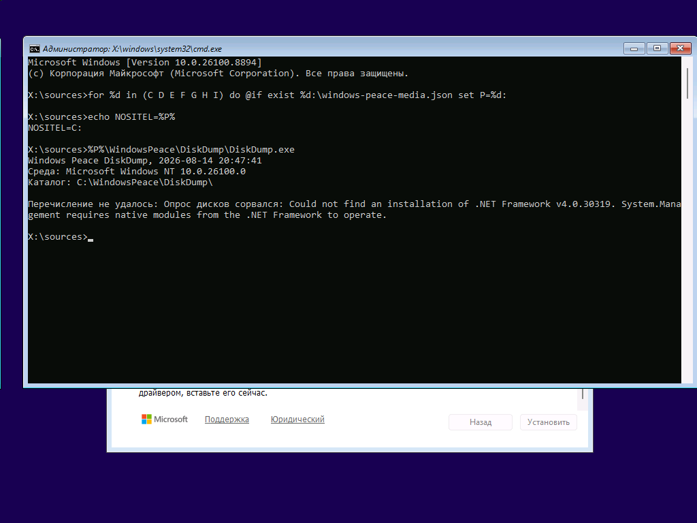
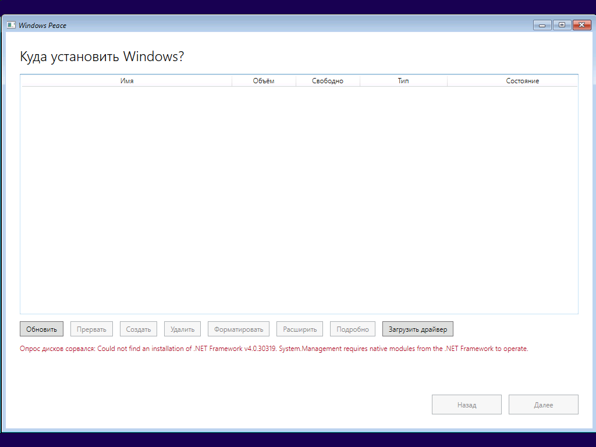

# Опыты шага Б: что показал WinPE

Дата: 14.08.2026 · [План шага Б](../plans/2026-08-14-step-b-winpe.md), задачи 4 и 6
· Стенд: виртуалка Hyper-V, второе поколение, 4 ГБ, безопасная загрузка включена

## Коротко

**Главный технический риск проекта снят.** Самодостаточное .NET 8 в WinPE
запускается, WPF рисует окно, кириллица на месте. Ни ADK, ни HTA не понадобились.

**Найдена другая преграда, помельче и решаемая.** Библиотека `System.Management`,
через которую мы спрашиваем WMI, оказалась несамостоятельной: она подгружает
native-модуль из .NET Framework 4.8, а в WinPE его нет.

## Что проверялось и чем

Носитель собран `tools/Media/Build-PeaceMedia.ps1`: два раздела, FAT32
«системный EFI» без буквы и NTFS с приложением. `install.wim` пропущен —
до шага В он не нужен.

Образ `boot.wim` **не правился**: машина грузится в обычный установщик
Windows, командная строка открывается по Shift+F10. Так сделано намеренно,
чтобы отказ отрисовки нельзя было спутать с отказом нашей подмены запуска.

Клавиши в виртуалку передаются через `Msvm_Keyboard`, экран снимается через
`GetVirtualSystemThumbnailImage`. Автор в опытах не участвовал.

## Опыт 1 — консоль



```
Windows Peace DiskDump, 2026-08-14 20:47:41
Среда: Microsoft Windows NT 10.0.26100.0
Каталог: C:\WindowsPeace\DiskDump\

Перечисление не удалось: Опрос дисков сорвался:
Could not find an installation of .NET Framework v4.0.30319.
System.Management requires native modules from the .NET Framework to operate.
```

Три строки заголовка напечатаны — значит **среда выполнения .NET 8 в WinPE
стартовала**. Это и был самый дорогой вопрос.

Сорвалось перечисление дисков, и причина названа точно.

Попутное наблюдение: раздел данных носителя получил в WinPE букву `C:`.
Букв в WinPE ждать нельзя, поиск по описи в корне каждого раздела —
единственный надёжный способ найти себя.

## Опыт 2 — окно



**WPF в WinPE работает.** Окно открылось, заголовок «Куда установить Windows?»,
таблица с шапкой, все семь кнопок в правильном состоянии, «Далее» выключена.
Кириллица читается, раскладка не рассыпалась, аппаратное ускорение не понадобилось.

Ошибка перечисления выведена красной строкой под таблицей — ровно там, где
ей положено быть по спеке шага А.

Из журнала на носителе:

```json
{"component":"Storage","operation":"Перечисление дисков","durationMs":257,
 "outcome":"Failure","reason":"System.PlatformNotSupportedException: Could not find
 an installation of .NET Framework v4.0.30319. System.Management requires native
 modules from the .NET Framework to operate. at System.Management.WmiNetUtilsHelper…
 at System.Management.MTAHelper.CreateInMTA… at WmiDiskEnumerator.Query…"}
```

## Разбор преграды

`System.Management` под .NET 8 — это обёртка. Настоящую работу за неё делает
`wminet_utils.dll` из папки .NET Framework 4.8. В WinPE эта папка есть, но
пустая: `Microsoft.NET\Framework\v2.0.50727` без `clr.dll`. Это было записано
в описи образа ещё в прошлой сессии — просто тогда никто не связал отсутствие
.NET Framework с работоспособностью `System.Management` под .NET 8.

Сама инфраструктура WMI в образе на месте: 468 записей в `System32\wbem`,
`StorageWMI`, `Windows.Storage.dll`. Недоступен именно мост между
управляемым кодом .NET Core и WMI.

## Что при этом сработало как задумано

Отказ занял 257 мс и был **громким**: программа не подвисла, вывела причину
на экран, оставила запись в журнале с длительностью, исходом и полным следом
вызовов. Раздел 9 архитектуры требует именно этого, и на первом же настоящем
отказе в чужой среде правило себя оправдало.

Отдельно подтвердилось решение держать всю логику в `WindowsPeace.Core`:
преграда упёрлась в один класс, `WmiDiskEnumerator`, за интерфейсом
`IDiskEnumerator`. Всё, что выше него, — правила выбора, предпросмотр
разметки, модели экранов, 90 тестов — отказом не затронуто.

## Что ещё подтвердилось попутно

- носитель нашей разметки грузится: прошивка UEFI приняла скрытый раздел
  «системный EFI» на виртуальном диске, безопасная загрузка включена;
- разрешение экрана WinPE — 1024×768, как и предполагалось в спеке;
- окно 1024×720 в него влезает;
- снимок экрана гостя и передача клавиш работают, круг проверки — две минуты
  без участия автора.

## Что осталось нерешённым

Чем заменить `System.Management`. Решение за автором, варианты вынесены
в отдельный разговор.
